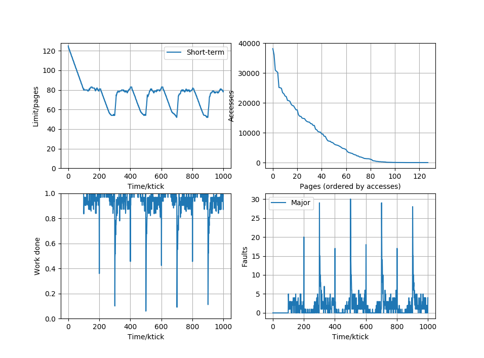

# psim

psim is a Linux memory subsystem simulator used for evaluating memory squeezing algorithms.

It simulates a VM performing a workload and measures the amount of work done in a given time.

For every simulator tick:
- the workload determines which memory page the vCPU accesses
   - accessing a free or unmapped page incurs a minor fault, blocking the vCPU from doing work for a short time;
   - accessing a paged-out page incurs a major fault, blocking the vCPU from doing work for a prolonged time;
- the vCPU does a unit of work on the page.

Linux memory subsystem behaviour is simulated:
- Periodically scan memory to update active/inactive lists according to page accesses since last scan
   - inactive pages are candidates for paging out
   - page out if the number of allocated pages exceeds the memory limit.

Further reading: Mel Gorman, Understanding the Linux Virtual Memory Manager (chapter 10), http://www.kernel.org/doc/gorman/.

## Files

- psim.py -- executable for running simulator
- host.py -- host memory simulator core
- workload.py -- contains various workload models
- squeezer.py -- contains various memory squeezer algorithm implementations

## Pre-requisites

Running psim requires python-matplotlib.

## Usage

Example command-line:
    python psim.py --memory=128 --ticks=1000000 --squeezer=mk2

Example output:

